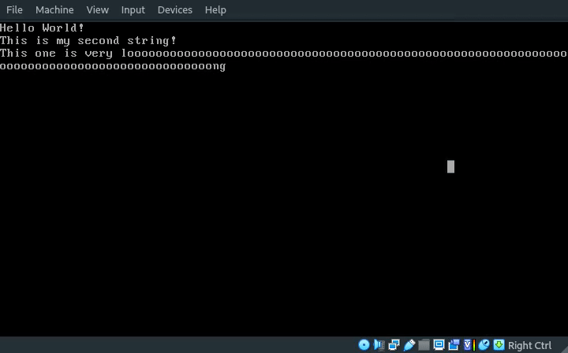

# My-Own-OS [WIP]

[Self teaching] Writing my own Operating System. Inpsired by "Write your own Operating System"'s [youtube series](https://www.youtube.com/watch?v=1rnA6wpF0o4&list=PLHh55M_Kq4OApWScZyPl5HhgsTJS9MZ6M) and related [GitHub repo](https://github.com/AlgorithMan-de/wyoos)

# Current Progress

- The OS compiles to .iso file
- implemented basic printf() function, allowing the kernel to print text to the screen. 
- Enabled interupts
- implemented keyboard support
- implemented mouse support

# Requirements 

## On Debian Based Systems

``g++``
``binutils``
``libc6-dev-i386``
``grub-legacy``
``xorriso``

## On Arch Based Systems

``g++``
``binutils``
``libc6-dev-i386``
``libisoburn``
``mtools``

# Compiling

``make mykernel.iso``
