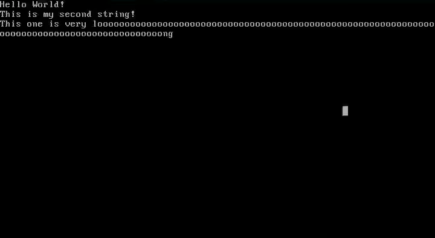

# My-Own-OS [WIP]

[Self teaching] Writing my own Operating System. Inpsired by "Write your own Operating System"'s [youtube series](https://www.youtube.com/watch?v=1rnA6wpF0o4&list=PLHh55M_Kq4OApWScZyPl5HhgsTJS9MZ6M) and related [GitHub repo](https://github.com/AlgorithMan-de/wyoos)

# Current Progress

### Completed

- The OS compiles to .iso file
- Implemented basic printf() function, allowing the kernel to print text to the screen. 
- Enabled interupts
- Implemented keyboard support
- Implemented mouse support
- Established communicatiion with Peripheral Component Interconnect (PCI) Devices
- Enabled VGA based graphical environment
- GUI framework for basic desktop and windows
- Multitasking

### Working On

- Dynamic Memory Management / Heap




# Requirements 

## On Debian Based Systems

``g++``
``binutils``
``libc6-dev-i386``
``grub-legacy``
``xorriso``

## On Arch Based Systems

``g++``
``binutils``
``libc6-dev-i386``
``libisoburn``
``mtools``

# Compiling

``make mykernel.iso``

# Possible Issues and Solutions

## undefined reference to `__stack_chk_fail_local'
When compiling, GCC may give the error ``gdt.cpp:(.text+0xa2): undefined reference to `__stack_chk_fail_local'``. If this happens, create function ``__stack_chk_fail_local()`` inside the file GCC says it can't find it in. Keep in mind that there can only be one of these functions, so if it's already implemented somewhere else you will have to move it. As of writing this, the ``__stack_chk_fail_local`` function is already written in ``myos/src/gdt.cpp``. If it is ever moved in this repository, you can find it by searching for ``__stack_chk_fail_local`` in github's "search in this repository" feature.

### Example of implemented function:

```C++
uint32_t __stack_chk_fail_local(){
    return 0;
}
```

Further information about this issue has been [discussed in another repository](https://github.com/AlgorithMan-de/wyoos/issues/15)

